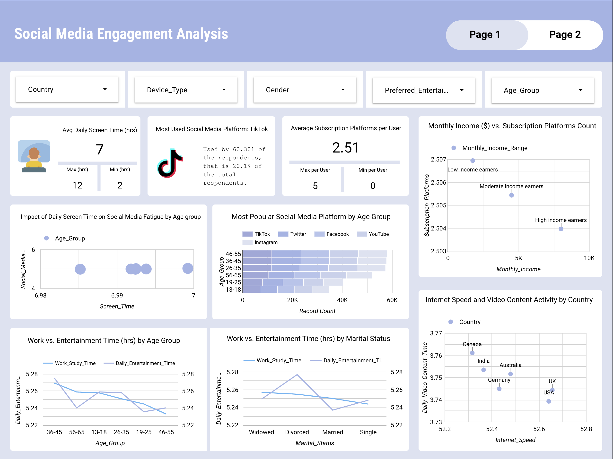
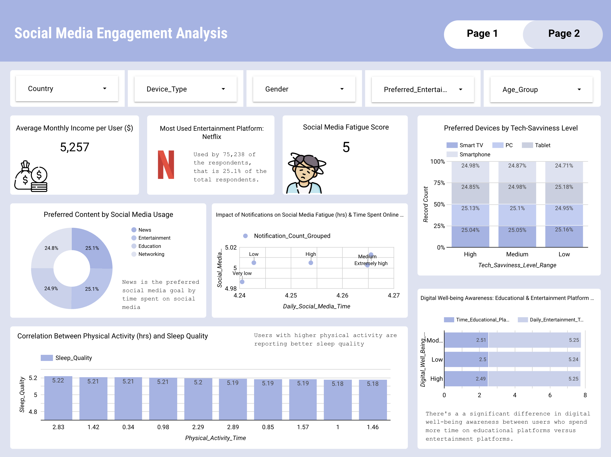

# A Data-Driven Exploration to Analyze and Understand Digital Behaviour

**Dataset**: Gotten from DataCrunch & PowerBI Peer Review Hub Task (social_media_entertainment_data.csv)

**Dataset dictionary**: Contained in the "social_media_entertainment_dictionary.csv" file

## Project Overview

This project aims to analyze digital behavior trends, focusing on user preferences, screen time habits, digital well-being, and tech savviness. The dataset includes information on internet usage, social media habits, subscription services, and time management patterns. 

Through data cleaning, transformation, and visualization, I uncover key insights and provide recommendations to help organizations better understand digital consumption.

## Data Cleaning & Transformation

Before diving into the analysis, I performed essential data cleaning steps:

1. Checked for missing values & duplicates

- Used `df.isnull().sum()` and `df[df.duplicated()]` to check for missing and duplicate value. 
- Findings: There were no missing or duplicate values.

2. Renamed columns for consistency

- Standardized column names using df.rename(columns={}).

3. Validated data types

- The data types for each columns were all accurate, so there was no need to change any of them.

4. Performed Exploratory Data Analysis (EDA)

- Summary statistics for numerical columns

- Count of unique values for categorical columns

5. Created new calculated columns

- Online Activity Share (percentage of screen time spent on video, gaming, and messaging)
- High/Low Tech-Savviness (categorize Tech Savviness Level into Low and High)
- Work-to-Entertainment Ratio (how much time is spent on work/study vs entertainment)

6. Checked for missing values after transformation and found none, so I went ahead to save my cleaned dataset in a new csv file.

**File**: Complete code for the data cleaning process can be found in the "Social Media Analysis.ipynb" file.

**Cleaned Dataset**: Can be found in the "cleaned_social_media_dataset.csv" file

## Key Questions & Insights

The key questions to be answered was gotten from the "Social Media Questions.docx" file.

### User Behavior and Preferences

1. What is the correlation between daily screen time and social media fatigue levels?

- Insight: A strong positive correlation was found. Most of the users were spending 6+ hours daily online and they reported significantly higher fatigue levels, varying among age groups.

- Visualization: Scatter Plot (Screen Time vs. Fatigue Score by age group)

2. Which social media platform is most commonly used as the primary platform across different age groups?

- Insight: YouTube dominates among users aged 13-18, while Twitter remains strong among users 35+, followed by TikTok in both cases.

- Visualization: Stacked Bar Chart (Age Group as dimension, Primary Platform as the breakdown dimension, and Record Count as metric)

### Demographics and Digital Usage

3. How does internet speed (Mbps) vary by country, and does it influence time spent on online activities?

- Insight: Countries involved all had an average internet speed greater 50 Mbps, which had users spending more time on video content and other online activity, with little disparity between time spent among each country.

- Visualization: Scatter Chart (Country as dimension, Avg Internet Speed and Avg Video Daily Content Time as metrics)

4. What is the relationship between monthly income and the number of subscription platforms?

- Created a new calculated field (Monthly_Income_Range) to group user's monthly income by low, moderate, and high.

- Insight: The monthly income didn't have an effect on the number of platforms users subscribed to. They all subscribed to an average of 2.5 platforms. Though suprisingly, low income earners' subscriptions surpassed those of moderate and high income earners by 0.01 or less.

- Visualization: Bubble Chart (Monthly Income Range as dimensions, Average of Monthly Income and Average of Subscription Platforms as metrics)

### Time Management and Productivity

5. How does time spent on work/study compare with time spent on entertainment activities? Across age group and marital status

- Insight 1: Users in age group of 55+ spent a little bit more on work/study than on entertainment, while users within age group of 13 - 18 spent the same amount of time on work/study and entertainment.

- Insight 2: I found that people who fell under the 'divroced' category spent a significant amount of time on entertainment than on work/study. Other categories, except 'single' spent roughly same amount of time on entertainment and work/study with work/study time being slightly more. 

- Visualization: Line Chart (Age Group vs. Work Study Time and Entertainment Time)
- Visualization: Line Chart (Marital Status vs. Work Study Time and Entertainment Time)

6. Are users with higher physical activity time also reporting better sleep quality?

- Insight: I won't say there was much correlation between the two as results varied. For example, pyhsical activity of one was 2.75 hours and average sleep quality was 4.93, whereas, someone with pyhical activity of 1.46 hours had an average sleep quality of 5.18.

- Visualization: Bar Chart (Physical Activity vs. Sleep Quality)

### Engagement with Content and Platforms

7. What type of preferred content (educational, entertaining) leads to higher daily social media time?

- Insight: Users consuming News content spent slightly more time (roughly few minutes) on social media than those focused on entertainment content, which was the second most prefered content by time spent.

- Visualization: Pie Chart (Content Type vs. Avg Daily Social Media Time)

8. How does the number of notifications received daily affect social media fatigue levels?

- Created a  new calculated column to group notifications count by very low, low, medium, high, and very high.

- Insight: Users receiving 150+ notifications per day showed higher fatigue scores and spent slightly more time on social media.

- Visualization: Scatter Chart (Notification Count Grouped vs Avg. Notifications Count & Avg. Social Media Fatigue Score)

### Tech Savviness and Device Usage

9. What devices are preferred by users with high tech-savviness levels for entertainment consumption?

- Insight: High tech-savvy users favor PC (desktops/laptops) for entertainment consumption, medium tech-savvy users prefer PC also, while low tech-savvy users prefer tablets.

- Visualization: 100% Stacked Column Chart (Tech-Savviness Level Range vs. Prefered Entertainment Device)

10. Is there a difference in digital well-being awareness between educational vs. entertainment platform users?

- Insight: There's a a significant difference in digital well-being awareness between users who spend more time on educational platforms versus entertainment platforms, with the ones spending more time on entertainment platform being more.

- Visualization: Grouped Bar Chart (Digital Well-being Awareness Score vs. Educational Platform Time & Entertainment Time)

So what are my suggestions and the key takeaways?

## Key Takeaways & Recommendations

1. Improve digital well-being awareness

- Encourage users to set daily screen time limits and reduce notifications.

- Promote mindfulness apps and digital detox programs.

2. Encourage balance between work & entertainment

- Organizations should promote work-life balance strategies, such as focus mode settings.

3. Personalized digital experiences based on age groups

- Platforms should tailor content recommendations for different demographics to improve engagement.

## Dashboard pages 👇
 
 

#### [Full report](https://lookerstudio.google.com/s/hhgSYseGzZg)

### Full report PDF👇

## Final Thoughts

- This analysis will help organizations and decision-makers optimize user experience, content strategy, and digital well-being initiatives. 

- Businesses can use these findings to refine engagement strategies, improve platform design, and tailor content to different demographics.

- Individuals can leverage the insights to manage screen time effectively, enhance productivity, and make informed choices about their digital habits.

#### Next Steps: 
Integrate machine learning models to predict digital fatigue levels based on behavioral trends
